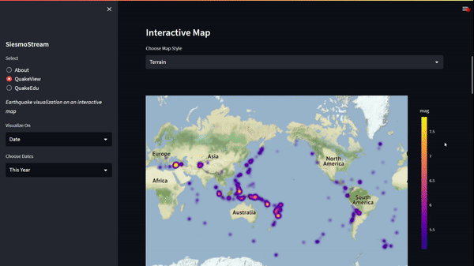

# SiesmoStream
 

     
 
 

 
 

  

## About 
If you're anything like me, you're probably fascinated by the powerful forces of nature that can shake the ground beneath our feet. That's why I created this app - to help you explore and visualize earthquake data in a fun and interactive way!

With the app, you can easily plot earthquake data on a map and explore patterns and trends over time. Whether you're a seasoned geologist or just a curious beginner, this app is perfect for anyone who wants to learn more about earthquakes and their impact on the world.

So go ahead and give it a try! You might just discover something new and exciting about this amazing planet we call home.

## Features
- Interactive maps that allow you to explore earthquakes by location. You can zoom in or out and click on any point to see the details of the earthquake that occurred at that location.
- Animations that show you how earthquakes have occurred over time. These animations give you a great perspective on how earthquakes have evolved over a specific period.
- Bar charts and line charts that show you how the frequency and magnitude of earthquakes have changed over time. 

## Intallation and usage
* Clone this repository  
`https://github.com/Aditya-Ramachandran/SiesmoStream.git`
* Change the working directory to the cloned repository by running  
`cd SiesmoStream`
* Install the required dependencies by running 
`pip install -r requirements.txt`
* To use the app, run the following command in your terminal 
`streamlit run app.py`
* The app will open in your default browser and you can start visualizing earthquakes

## Credits
- Earthquake data provided by the USGS API (https://earthquake.usgs.gov/fdsnws/event/1/)
- Geocoding data provided by the OpenCage Data API (https://opencagedata.com/api)

## Contributing
Thank you for considering contributing to this project! If you would like to contribute, please make sure to read the [contribution guidelines](CONTRIBUTING.md) before making a pull request.

## License
This project is licensed under the MIT License - see the LICENSE file for details.

